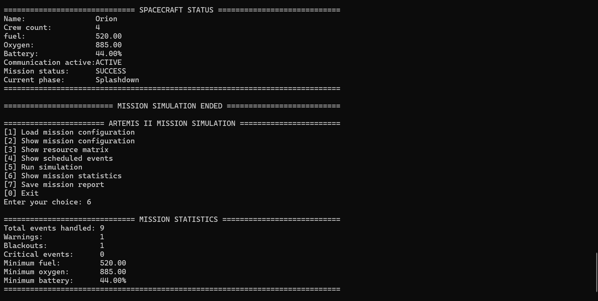

# Artemis Mission Simulation

A C-based console application that simulates the Artemis II space mission from launch to splashdown while monitoring spacecraft resources, mission events, communication status, and mission statistics.

## Screenshot



## Main Features

- Load mission configuration from a configuration file (`config.txt`)
- Display the loaded mission configuration
- Display the mission resource consumption matrix
- Schedule and display mission events in chronological order
- Simulate the complete Artemis II mission
- Track spacecraft fuel, oxygen, and battery levels throughout the mission
- Monitor spacecraft communication status
- Detect resource warnings and critical mission conditions
- Display mission statistics
- Generate a mission log during the simulation
- Save a detailed mission report to a text file

## C Programming Concepts

This project demonstrates:

- Modular programming using separate `.c` and `.h` files
- Structures (`struct`)
- Pointers
- Singly linked lists
- Dynamic memory allocation (`malloc` / `free`)
- Dynamic two-dimensional arrays
- File input and output
- String handling
- Memory management
- Console-based application design

## Mission Flow

The simulation follows these mission phases:

1. Launch
2. Earth Orbit
3. System Check
4. Trans-Lunar Injection (TLI)
5. Lunar Flyby
6. Communication Blackout
7. Return Trajectory
8. Reentry
9. Splashdown

## Project Structure

```text
Main.c
mission.c / mission.h
spacecraft.c / spacecraft.h
event.c / event.h
menu.c / menu.h
file_manager.c / file_manager.h
config.txt
```

## Technologies

- C
- Visual Studio 2022
- Standard C Library
- Windows Console Application

## Generated Files

The program uses and generates the following files:

- **config.txt** – mission configuration and resource consumption data
- **mission_log.txt** – records mission events and spacecraft status throughout the simulation
- **mission_report.txt** – contains the final mission summary and statistics

## How to Run

1. Open `ArtemisMissionSimulation.sln` in Visual Studio.
2. Build the solution.
3. Run the project.
4. Load the mission configuration.
5. Run the mission simulation.
6. View the mission statistics or save the mission report.


## Author

Developed independently by Gaya Cohen as an academic C programming project.
